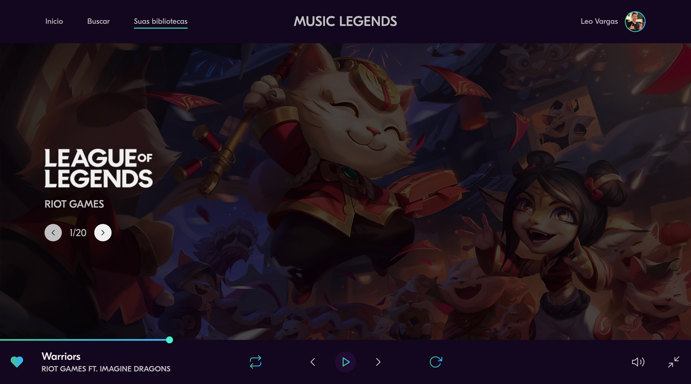

<h1 align="center">
  Music Legends
</h1>

  
  
  
  
  

  
  
  

  

## 💻 Projeto

Esse projeto foi desenvolvido durante uma _livecoding_ na [Twitch.tv](https://www.twitch.tv/leovargasdev).
O protótipo desse website foi desenvolvido pelo [**Iuri Silva**](https://www.instagram.com/iuricode/), [clique aqui](https://www.figma.com/file/Yb9IBH56g7T1hdIyZ3BMNO?node-id=80254%3A868) para abrir o protótipo no figma.

## 🚀 Tecnologias

-  HTML
-  CSS
-  JavaScript
-  SVG Inject

## 📔 Conhecimentos abordados

- [x]  Uso semântico do HTML;
- [x]  Uso de variáveis globais no `:root`;
- [x]  Importação de `font` local;
- [x]  Evento para navegar entre as músicas;
- [x]  Evento de timer na música;
- [x]  Navegação pelo teclado(pausar música, avançar e voltar música);

## 📺 Vídeos no Youtube

### #1 MUSIC LEGENDS - CRIANDO A ESTRUTURA INICIAL DA PÁGINA

---
### #2 MUSIC LEGENDS - DEIXANDO A APLICAÇÃO RESPONSIVA

### #3 MUSIC LEGENDS - EVENTOS VIA JAVASCRIPT 

